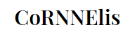

 <h2 align="center"> CoRNNelis </h2>
 

   
 

This application is generates new text based on the book Cornelis Guldewagen, brouwer, regent en juridisch talent.
The model uses input from the user to give back sentences based on patterns it has found in the book.

The HTML and JavaScript parts were derived from this ML5JS tutorial
https://learn.ml5js.org/docs/#/reference/charrnn

The custom RNN is trained using this repository. 
https://github.com/sherjilozair/char-rnn-tensorflow. 

This repository uses:
- HTML
- JavaScript
- Python
- ML5JS
